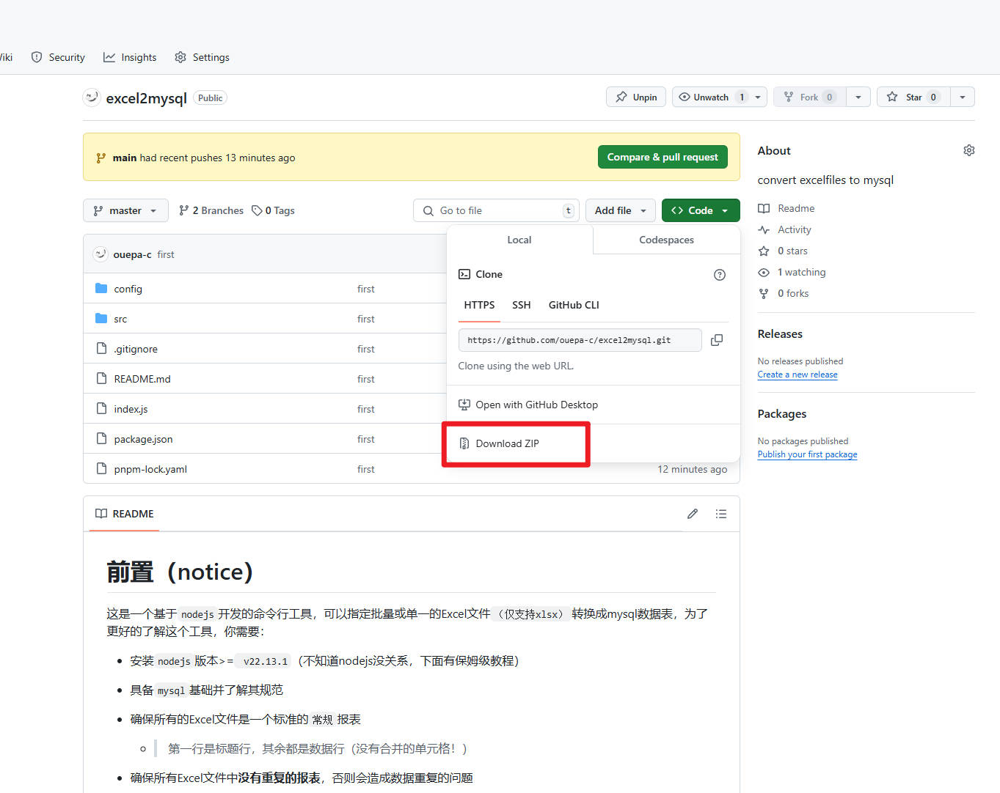
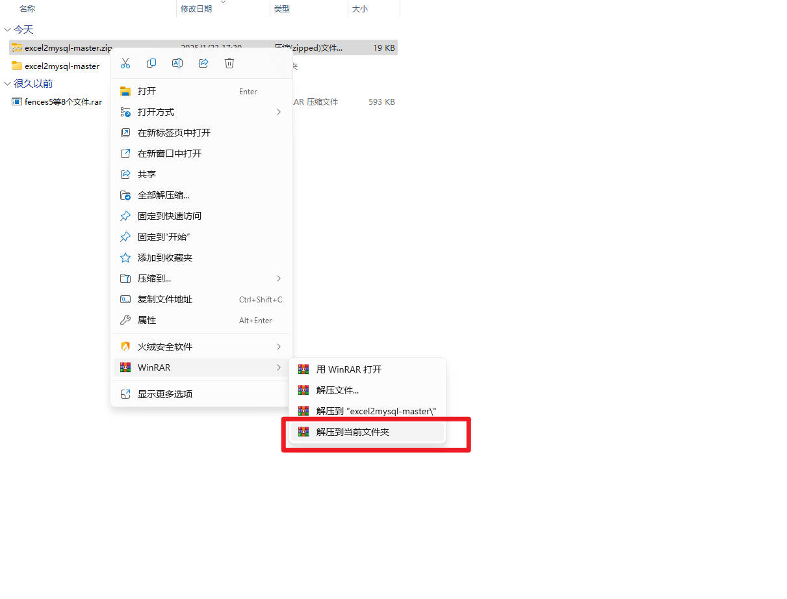
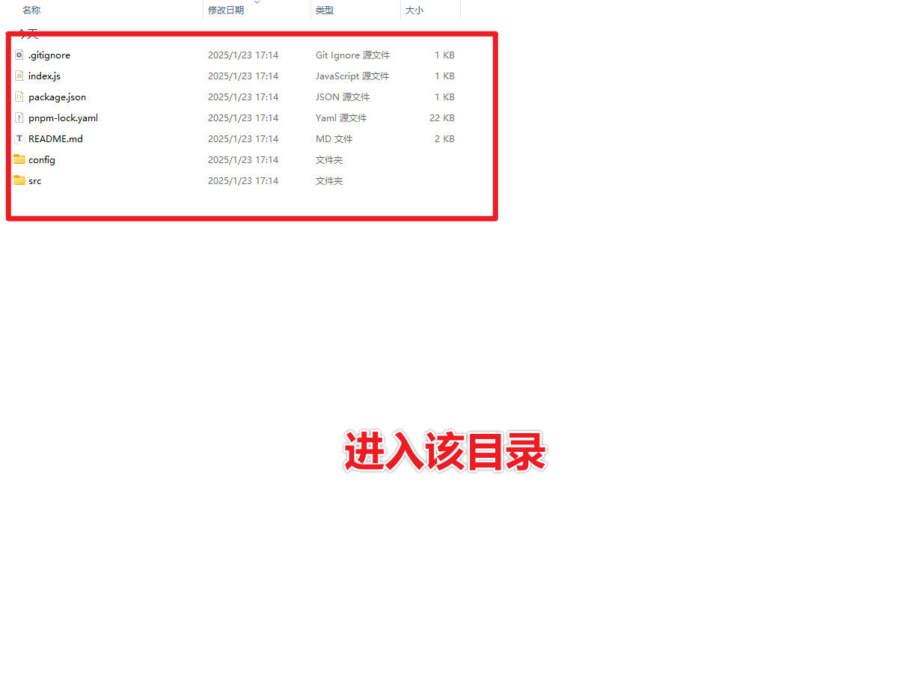
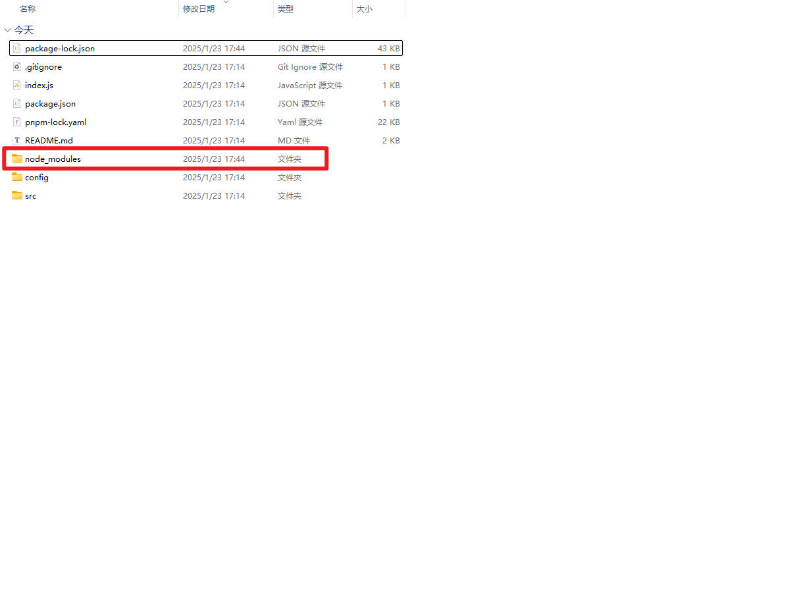
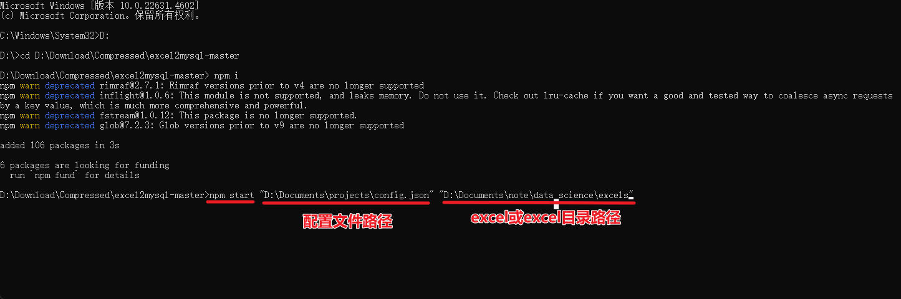
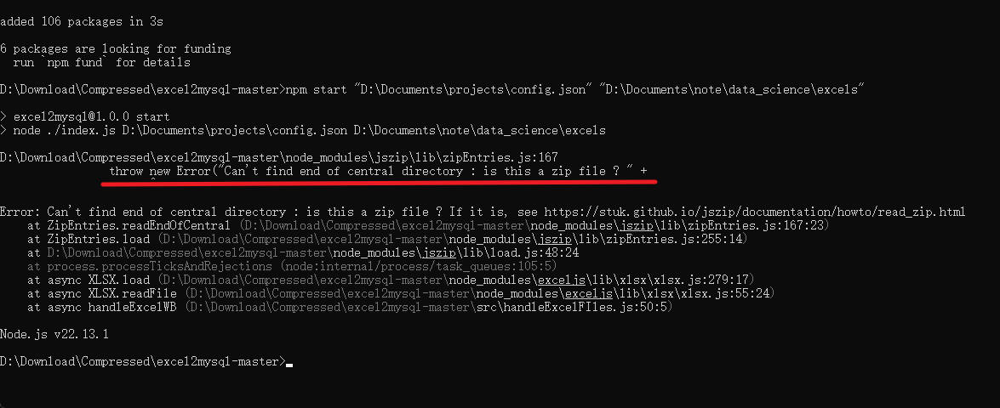
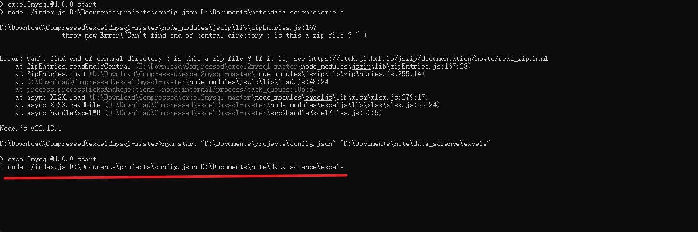

# 前置（notice）

这是一个基于`nodejs`开发的命令行工具，可以指定批量或单一的Excel文件`（仅支持xlsx）`转换成mysql数据表，为了更好的了解这个工具，你需要：

+ 安装`nodejs`版本>=` v22.13.1`（不知道nodejs没关系，下面有保姆级教程）

+ 具备`mysql`基础并了解其规范

+ 确保所有的Excel文件是一个标准的`常规`报表

    + > 第一行是标题行，其余都是数据行（没有合并的单元格！）

+ 确保所有Excel文件中**没有重复的报表**，否则会造成数据重复的问题

+ 由于性能原因，程序在判断数据类型的时，是根据报表的**最后一行**判断，所以请补齐最后一行数据

    + 日期默认为`DATE`，数字默认为`DECIMAL`，字符串默认为`VARCHAR`，空单元格默认为`VARCHAR`。
    + 如果需要使用`DATETIME`或`TIMESTAMP`等其他数据类型，请参考<u>自定义数据类型</u>

+
确保本地的MYSQL开启了native_password，参考[ERROR 1524 (HY000): Plugin ‘mysql_native_password‘ is not loaded](https://blog.csdn.net/xiaohua616/article/details/139477112).

# 用法(Usage)

安装nodejs最新版本`（>=v22.13.1）`,[NodeJS安装](https://nodejs.org/en).

1. 下载项目到本地

2. 解压缩

3. 进入该目录

4. `shift`+右键打开命令行（最好是管理员模式）

5. 输入`node -v`，看下是否可以正常显示版本号，如果不行请上网自行搜索**`如何安装nodejs`**。

6. 输入`npm i`，安装所需要的依赖，然后等待片刻

7. 然后会发现多了node_modules目录

8. 运行程序，一共有两个参数 输入`npm start <配置文件地址> <excel或者excel目录的地址>`,然后回车

9. 出现这个报错，表示你没有关闭其中的某些excel文件，建议关闭所有excel窗口

10. 继续执行，出现这个表示执行成功，然后返回到程序的文件夹

11. 你会发现在上一层多了一个日志文件

## 1.配置文件

# 常见的问题(Q/A)

